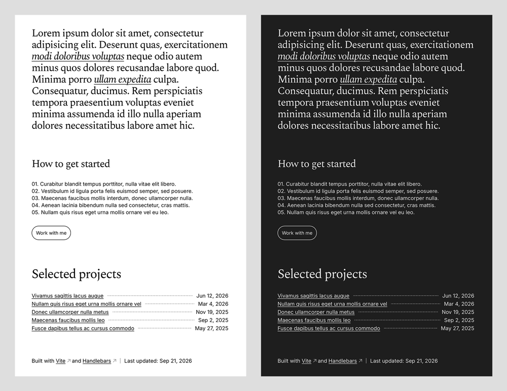

# One-page portfolio starter

This is a starter built with [Vite](https://vite.dev/guide/) and the [Handlebars](https://handlebarsjs.com/guide/), to quickly create and ship your own personal webpage.
Some familiarity with code will help you install, edit and ship it easily. Yet its structure and design have been made so that a fairly wide range of people can use it.
By design, it is more than a business card but less than a well-stuffed portfolio. But I tend to think it is enough to introduce yourself to potential clients or employers.
Content lives in small JSON files. Images are automatically processed by the sharp library. You rarely need to touch the code.



## Usage

1. Install [Node.js](https://nodejs.org) and its package manager.
2. Download the project from this repo. The simplest method is to click **Code → Download ZIP** and unzip it.
3. Open a terminal in the project folder and install the packages by running `npm install`.

Once the installation is complete, start the website with `npm run dev` and open http://localhost:5173 to see it.
Note that files like `.scss`, `.js`, and `.html` are covered by HMR, while `.json` changes require a page refresh to actually see them.
Build the final version into the `dist` folder with `npm run build`. The result is a complete static website that can be served by a wide range of hosting providers.

Check it with `npm run preview` before shipping it.


## Add a project

1. Create a folder in `src/assets/images`, like `project-6`, and put an image in it.\*
2. Add an entry to `src/data/projects.json`:

    ```json
    {
        "name": "Name of the project",
        "date": "2025-11-19",
        "path": "project-6",
        "liveUrl": "https://example.com",
        "description": "A few lines about the project."
    }
    ```

    - `path` must match the folder name exactly.
    - `liveUrl` is optional. Without it, no link is shown.

3. Restart `npm run dev` (press `Ctrl + C`, then run it again). The images are processed and `images` is filled in for you, adding this to the project:

    ```json
    "images": [
        {
            "alt": "",
            "desktop": "/images/resized/project-6/desktop/poster",
            "mobile": "/images/resized/project-6/mobile/poster"
        }
    ]
    ```

Give each image an `alt` text. It is kept when images are processed again.
Note that projects show in the order of the file. To remove one, delete its entry and its folder.
Do not edit `desktop` and `mobile`.

\*For now, only one image per project is allowed. This is by design, as I really wanted to keep it as simple as possible.
Nevertheless, a carousel component will soon be added to this setup, to be used as an alternative when a project has more than one image.

## Process the images

Images are processed automatically when you start `npm run dev` or run `npm run build`.
In order to avoid unnecessary use of resources, only new or changed images are included in the transformation pipeline.
Each image in `src/assets/images` is transformed into two sizes (1800px for large screens, 900px for phones) and three formats (JPG, WebP, and AVIF).
Accepted formats for originals are JPG, PNG, TIFF, WebP, and AVIF. 2000px wide is enough, given that the output never goes above 1800px.


## License

Use it, modify it, ship it. Do not sell it.
